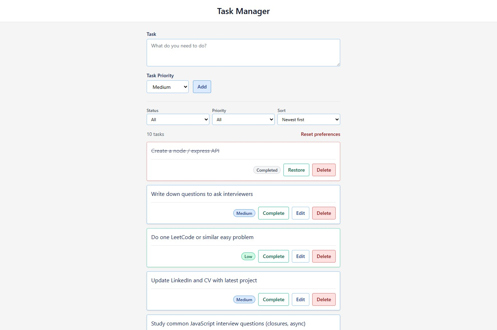

# Task Manager

A full-stack **Task Manager** with a React/TypeScript frontend and Node.js/Express backend. Add tasks with a priority, filter and sort your list, edit or complete items, and keep your preferences across refreshes. Built for clarity and accessibility.

**Who it’s for:** Anyone who wants a simple, keyboard-friendly task list in the browser — and developers or recruiters viewing the repo as a demo of a React + Express app.

---

## Screenshots

### Desktop view

| Start Screen                                                                 | Desktop Screen After Reset                                                 |
| ---------------------------------------------------------------------------- | -------------------------------------------------------------------------- |
| !Start Screen](./assets/desktop_version_start.jpg)                           |           |


### Filters and list


*Add your screengrabs to the `assets/` folder as `app-overview.png` and `filters-list.png`, or update the paths above to match your filenames.*

---

## Key features

- **Tasks with priority** — Create tasks with Low, Medium, or High priority; shown as coloured badges and subtle card borders.
- **Filter by status and priority** — Status: All / Active / Completed. Priority: All / High / Medium / Low.
- **Sort options** — Priority first, Newest first, or Oldest first; priority sort puts active high-priority tasks at the top.
- **Add, edit, complete, delete** — Inline edit for title and priority on active tasks; complete/undo and delete with immediate UI updates.
- **Persisted preferences** — Filter and sort choices are saved in `localStorage` and restored on refresh; task data stays on the server.
- **Task count** — Live count of visible tasks (e.g. “3 tasks”) with screen-reader-friendly updates.
- **Reset preferences** — One-click reset to “all tasks, newest first” without changing task data.
- **Backend persistence** — Tasks stored in `data/tasks.json` so they survive server restarts.
- **Validation** — Title length cap (500 chars), required priority on create/update, and clear API error messages.
- **Accessibility** — Semantic layout (header, main, list), skip-to-content link, visible focus rings, WCAG-oriented contrast, and sufficient touch targets.

---

## Tech stack

- **Frontend:** React 18, TypeScript, Vite, Tailwind CSS v4  
- **Backend:** Node.js, Express  
- **Node:** 22.22.0 (see `.nvmrc`)

---

## How to run

**Prerequisites:** Node 22.22.0. Use [nvm](https://github.com/nvm-sh/nvm) (or volta / asdf / fnm with `.node-version`).

```bash
# 1. Use the correct Node version (with nvm)
nvm install
nvm use

# 2. Install dependencies
npm install

# 3. Run frontend and backend together
npm start
```

This starts:

- **Frontend** (React + Vite) at [http://localhost:5173](http://localhost:5173)
- **Backend** (Express) at [http://localhost:3001](http://localhost:3001)

**Run frontend and backend separately:**

```bash
# Terminal 1 — backend
npm run server

# Terminal 2 — frontend
npm run dev
```

---

## Project structure

```text
tf-react-tech-test/
├── src/
│   ├── App.tsx           # Main app state, filter/sort, API handlers
│   ├── api.ts            # API client (getTasks, createTask, updateTask, deleteTask)
│   ├── types.ts          # Task, NewTask, UpdateTask, Priority
│   ├── main.tsx          # React entry
│   ├── index.css         # Tailwind + theme
│   └── components/       # AppLayout, AddTaskForm, TaskList, TaskItem, PriorityBadge, Button, Input, Select
├── server/
│   └── index.ts          # Express API and JSON file store
├── data/
│   └── tasks.json        # Persisted tasks (created at runtime)
├── assets/               # Screengrabs for this README
├── package.json
├── .nvmrc                # Node 22.22.0
└── README.md
```
